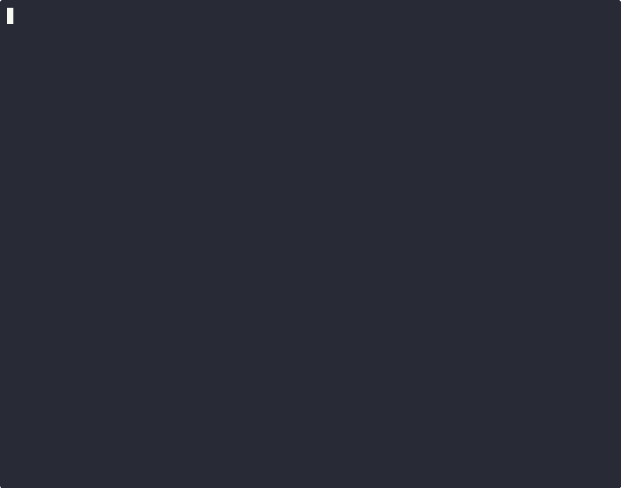

<h1 align="center">gitwise</h1>

<p align="center">
  <strong>AI-powered commit messages and PR descriptions from your terminal.</strong>
</p>

<p align="center">
  
</p>

<p align="center">
  <a href="https://github.com/aymenhmaidiwastaken/gitwise/releases"></a>
  <a href="LICENSE"></a>
  <a href="https://goreportcard.com/report/github.com/aymenhmaidiwastaken/gitwise"></a>
  <a href="https://github.com/aymenhmaidiwastaken/gitwise/actions/workflows/ci.yml"></a>
  <a href="#privacy"></a>
</p>

<p align="center">
  <strong><a href="#installation">Install</a></strong> · <strong><a href="#quick-start">Quick Start</a></strong> · <strong><a href="#features">Features</a></strong> · <strong><a href="#commands">Commands</a></strong> · <strong><a href="#configuration">Config</a></strong> · <strong><a href="CONTRIBUTING.md">Contributing</a></strong>
</p>

---

## The Problem

- Writing good commit messages is tedious — most developers write "fix bug" or "update stuff"
- PR descriptions are even worse — often left blank or copy-pasted
- Existing tools are abandoned, limited to commit messages only, and require cloud APIs
- No single tool generates commits **and** PR descriptions **and** does code review
- No tool supports local LLMs for privacy-sensitive codebases

## The Solution

```bash
git add .
gitwise commit        # AI generates a conventional commit message
gitwise review        # AI reviews your code for bugs before you commit
gitwise pr --create   # AI writes the PR description and opens it on GitHub
```

gitwise works with **Ollama** (local/private), **OpenAI**, **Anthropic**, **Google Gemini**, and any **OpenAI-compatible** endpoint (Groq, Together, LM Studio, vLLM).

---

## Installation

### Go install

```bash
go install github.com/aymenhmaidiwastaken/gitwise@latest
```

### Homebrew (macOS/Linux)

```bash
brew install aymenhmaidiwastaken/tap/gitwise
```

### Download binary

Grab the latest binary for your platform from [GitHub Releases](https://github.com/aymenhmaidiwastaken/gitwise/releases).

### From source

```bash
git clone https://github.com/aymenhmaidiwastaken/gitwise.git
cd gitwise
make build
```

---

## Quick Start

```bash
# 1. Interactive setup — detects your LLMs, creates config
gitwise setup

# 2. Stage changes and commit with AI
git add .
gitwise commit

# 3. Review code before committing
gitwise review

# 4. Generate a PR description
gitwise pr
```

---

## Features

| Feature | Description |
|---------|-------------|
| **Smart commits** | Generates conventional commit messages from staged diffs |
| **PR descriptions** | Structured PR descriptions with Summary, Changes, Testing, Breaking Changes |
| **AI code review** | Catches bugs, security issues, and performance problems |
| **Diff summary** | Plain-English explanation of staged changes |
| **Changelog** | Auto-generates CHANGELOG entries from commits between tags |
| **Commit linting** | Validates commit messages against conventional commit format |
| **Multiple suggestions** | Generate N options, pick the best one with a TUI picker |
| **Git hook** | Auto-generate messages on every `git commit` |
| **Gitmoji** | Optional emoji prefixes for commit types |
| **Monorepo support** | Detects npm/Go/Cargo workspaces, scopes commits per package |
| **Ticket detection** | Auto-links JIRA/Linear/GitHub tickets from branch names |
| **Style matching** | Reads repo history to match your team's commit style |
| **Cost estimation** | Shows token count and estimated cost for cloud providers |
| **Response caching** | Cache LLM responses for repeated dry-runs |
| **Streaming** | Token-by-token streaming for all providers |
| **Multi-language** | Commit messages in any language |
| **Custom endpoints** | Works with any OpenAI-compatible API |
| **Zero telemetry** | No tracking, no data collection, ever |

---

## Commands

### `gitwise commit`

```bash
gitwise commit              # Generate and commit
gitwise commit -i           # Interactive: accept, edit, regenerate, or cancel
gitwise commit -n 3 --tui   # Pick from 3 suggestions with arrow keys
gitwise commit --dry-run    # Preview without committing
gitwise commit -p openai    # Use a specific provider
```

### `gitwise review`

```bash
gitwise review              # AI code review of staged changes
```

Catches: logic errors, security vulnerabilities, performance issues, missing error handling, edge cases.

### `gitwise pr`

```bash
gitwise pr                  # Generate PR description
gitwise pr --labels         # Also suggest GitHub labels
gitwise pr --create         # Create PR on GitHub via gh CLI
gitwise pr --base develop   # Compare against specific base branch
```

Auto-reads `.github/pull_request_template.md` if present.

### `gitwise diff`

```bash
gitwise diff                # Summarize staged changes in plain English
```

### `gitwise changelog`

```bash
gitwise changelog                         # Latest tag to HEAD
gitwise changelog --from v1.0.0 --to v1.1.0  # Between specific tags
```

### `gitwise lint`

```bash
gitwise lint                # Lint last 10 commits
gitwise lint HEAD~5..HEAD   # Lint specific range
```

### `gitwise amend`

```bash
gitwise amend               # Regenerate the last commit's message
```

### `gitwise hook`

```bash
gitwise hook install        # Auto-generate messages on every git commit
gitwise hook uninstall      # Remove the hook
```

### `gitwise setup`

```bash
gitwise setup               # Interactive wizard: detect LLMs, create config, install hook
```

---

## Configuration

```bash
gitwise config init         # Create default config file
gitwise config show         # View current settings
```

### Config file (`~/.config/gitwise/config.yaml`)

```yaml
provider: ollama               # ollama, openai, anthropic, gemini, custom
model: llama3:latest           # auto-detected if empty
language: english              # commit message language
convention: conventional       # conventional, angular, none
max_diff_lines: 5000           # truncate large diffs
scope_from_path: true          # auto-detect scope from file paths
emoji: false                   # gitmoji prefixes
sign_commits: false            # GPG signing
show_cost: true                # show token count + estimated cost
cache_enabled: false           # cache LLM responses
ollama_url: http://localhost:11434
custom_endpoint: ""            # for Groq, Together, LM Studio, vLLM
custom_api_key: ""
```

### Environment variables

| Variable | Description |
|----------|-------------|
| `GITWISE_PROVIDER` | Override provider |
| `GITWISE_MODEL` | Override model |
| `OPENAI_API_KEY` | OpenAI API key |
| `ANTHROPIC_API_KEY` | Anthropic API key |
| `GEMINI_API_KEY` | Google Gemini API key |
| `OLLAMA_URL` | Ollama server URL |
| `GITWISE_CUSTOM_ENDPOINT` | Custom OpenAI-compatible endpoint |
| `GITWISE_CUSTOM_API_KEY` | API key for custom endpoint |

### `.gitwiseignore`

Add a `.gitwiseignore` file to your repo to exclude files from diff analysis:

```
generated/api_client.go
**/__snapshots__/*
*.generated.ts
```

---

## LLM Providers

### Ollama (local — default)

```bash
ollama pull llama3
gitwise commit    # auto-detects the best available model
```

### OpenAI

```bash
export OPENAI_API_KEY="sk-..."
gitwise commit -p openai -m gpt-4o
```

### Anthropic

```bash
export ANTHROPIC_API_KEY="sk-ant-..."
gitwise commit -p anthropic
```

### Google Gemini

```bash
export GEMINI_API_KEY="..."
gitwise commit -p gemini
```

### Custom (Groq, Together, LM Studio, vLLM)

```bash
export GITWISE_CUSTOM_ENDPOINT="http://localhost:1234"
gitwise commit -p custom -m local-model
```

---

## Comparison

| Feature | gitwise | aicommits | cz-cli |
|---------|---------|-----------|--------|
| Commit messages | Yes | Yes | Yes (manual) |
| PR descriptions | Yes | No | No |
| AI code review | Yes | No | No |
| Changelog generation | Yes | No | Yes |
| Commit linting | Yes | No | Yes |
| Local LLMs (Ollama) | Yes | No | No |
| Custom endpoints | Yes | No | No |
| Multiple suggestions | Yes | No | No |
| Git hook integration | Yes | Yes | Yes |
| Monorepo support | Yes | No | No |
| Ticket detection | Yes | No | No |
| Streaming output | Yes | No | N/A |
| Cost estimation | Yes | No | N/A |
| Actively maintained | Yes | No | Yes |

---

## Privacy

**Zero telemetry. Zero tracking. Zero data collection.**

gitwise never phones home. When using Ollama or LM Studio, your code never leaves your machine. Cloud providers only see the diff — nothing else.

---

## Shell Completions

```bash
gitwise completion bash > /etc/bash_completion.d/gitwise     # Bash
gitwise completion zsh > "${fpath[1]}/_gitwise"              # Zsh
gitwise completion fish > ~/.config/fish/completions/gitwise.fish  # Fish
gitwise completion powershell > gitwise.ps1                  # PowerShell
```

---

## Contributing

See [CONTRIBUTING.md](CONTRIBUTING.md) for development setup, project structure, and how to add providers or commands.

---

## License

[MIT](LICENSE) — Aymen Hmaidi
